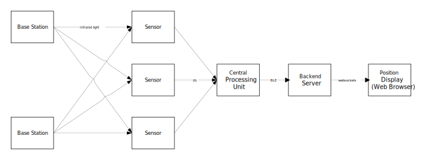
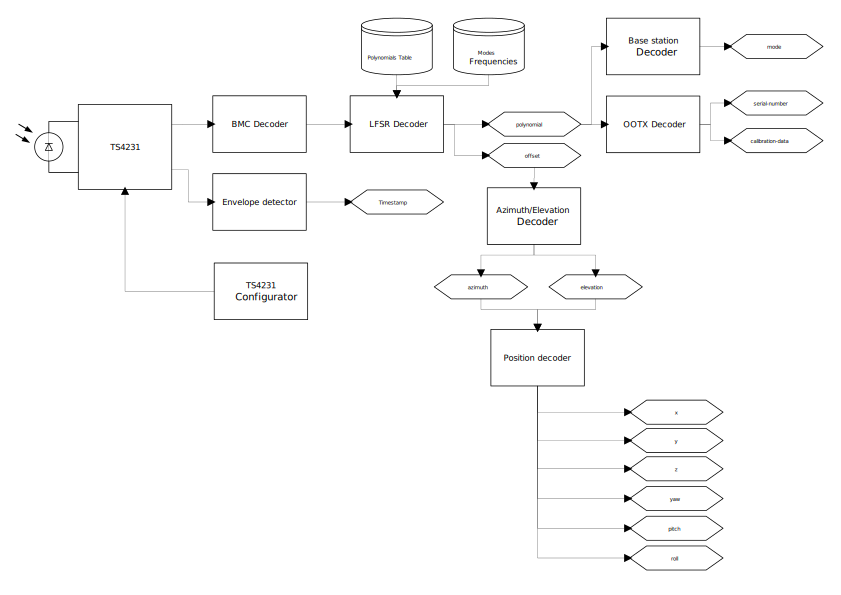

# Lighthouse v2 DIY tracker

Random gathered information about the HTC Vive tracking system to be used with the Base Stations version 2 (one rotor).

## Definitions

- **LH2** or **lighthouse**: an HTC Vive base station v2
- **OOTX** Omnidirectional Optical Transmitter
- **LFSR** [Linear-feedback shift register](https://en.wikipedia.org/wiki/Linear-feedback_shift_register)
- **BMC** [Biphase Mark Code](https://en.wikipedia.org/wiki/Differential_Manchester_encoding), quite similar to Manchester encoding

## Base stations parameters

- Beam data
  - Modulation frequency: 6 MHz
  - Encoding method: BMC
  - Frame length: 17 bits
  - Content: maximum length 17-bits LFSR
- Sweep
  - Frequency: ~50 Hz

## Project

The goal of this project is to create a DIY application with the HTC LH2 v2. The position of an embedded system should be visualized on a Web Browser.



## Sensors

Each sensor captures:

- The arrival beam timestamp `time` (against internal timer)
- The first 17 bits of encoded data in the beam carrier: `cipher`
- LFSR polynomial used to generate the beam data
- Time offset `offset`, from the LH2 Sync Event and the received pulse
- Sensor ID (each DIY sensor should have its own ID)
- Width of the received pulse in seconds `width`

Width could be used to approximate the distance from the basestation.

During each sweep, each sensor is able to read anywhere from 17..50 bits of the encoded signal while the laser is passing by.

## Protocol

Each LH2 emits two infrared sweeps : one at 45° from the ground carrying the azimuth information, another at -45° carrying the elevation.

These angles can be retreived by decoding the infrared beam captured by each sensor.

Each captured beam frame looks as follow :

```
   <---> 166 ns (6 MHz)

   +---+ +-+   +-+ +-+ +---+
   |   | | |   | | | | |   |               Encoded data
---+   +-+ +---+ +-+ +-+   +--- ...
    1 1 0 1 0 0 1 0 1 0 1 1 0 0            BMC data
    --- --- --- --- --- --- ---
     0   1   0   1   1   0   0             Cipher (> 17 bits)
---+                                  +---
   |                                  |    Envelope
   +--------------------------- ... --+
   <---------------------------------->
                  width

   ^ Arrival Time
```

The cipher is generated using a 17 bit LFSR initialized with the value `0x01` and configured with a polynomial. Each LH2 uses different sets of polynomials.

Initially the tracker does not know which polynomials are in use. It has to decode them by brute forcing all possibilities ~ 131'071 different combination. This is possible using two frames captured by two different sensors with a small difference.

### Polynomials

All the available polynomials have their maximal period size : 131'071 different values. Each value gives an information about the time offset since the beam sync time. The beam speed is about 50 pi rad/sec. 131'071 / 6e6 = 21.84 ms.

32 polynomials appear to be used on a v2 lighthouse. The first two are:

```
x^17 + x^13 + x^12 + x^10 + x^7 + x^4 + x^2 + x^1 + 1
x^17 + x^14 +  x^7 +  x^6 + x^5 + x^4 + x^3 + x^2 + 1
```

They can be expressed in their hexadecimal form:

```
0x0001D258, 0x00017E04
0x0001FF6B, 0x00013F67
0x0001B9EE, 0x000198D1
0x000178C7, 0x00018A55
0x00015777, 0x0001D911
0x00015769, 0x0001991F
0x00012BD0, 0x0001CF73
0x0001365D, 0x000197F5
0x000194A0, 0x0001B279
0x00013A34, 0x0001AE41
0x000180D4, 0x00017891
0x00012E64, 0x00017C72
0x00019C6D, 0x00013F32
0x0001AE14, 0x00014E76
0x00013C97, 0x000130CB
0x00013750, 0x0001CB8D
```

The initial value for the LFSR is `0x01`.

Finding the set of polynomials used for each LH2 station allows to decode the base station channel with the relation `(nPoly / 2 + 1)`.

# OOTX

Each base station has its own set of eccentricities or non-ideal behavior. At the factory, these non-ideal parameters are calculated and stored in the base station. In the field, each base station transmits its calibration parameters.

Within v1, the OOTX data were sent through the sync pulses. In v2, they are encoded in the beam at one bit per sweep.

Slow data ? It gives sensor device information on the lighthouse:

- Serial number
- Calibration data
- ...

# Modes?

16 modes ofr the LH2 each has a slighly different rotation frequency and two distinct polynomials used. OOTX is about 128 bytes (bitrate about 100 bps

# Multiple Lighthouses?

No synchronization between lighouses ? This explains why each lighthouse has different RPM. Collisions would be very rare.

## Correlation between two sensors

Find sync time by runniong LFSR from 1 until reach value

## RPM modes

- 21.85 ms
- 19.98 ms

## Architecture

A possible architecture overview



## Useful resources and references

- [ESPTracker issue #1](https://github.com/cnlohr/esptracker/issues/1)
- [Lighthouse v2 pictures](https://drive.google.com/drive/folders/1cRZ3P2-qimd7ccLXDEDPEvQxj6XS1rv1)
- [libdeepdive](https://github.com/asymingt/deepdive)
- [Tundra Labs TL448K6D](https://static1.squarespace.com/static/5c23a4e41137a63d93190b61/t/5e1e074936fe03405bf50116/1579026250766/TL448K6D-VR_Datasheet_v1p1.pdf)
- [LFSR Polynomials](https://github.com/cntools/libsurvive/blob/c1ca3657fd305a5aef60ac862c9ff60aa67469c9/src/lfsr_lh2.c#L22)
- [Lighthouse2Tools](https://github.com/jdavidberger/lighthouse2tools)
- [Discord](https://discord.gg/WYYJyc2)
- [libsurvive](https://github.com/cntools/libsurvive)
- [Alan Yates conference](https://hackaday.com/2016/12/21/alan-yates-why-valves-lighthouse-cant-work/)
- [Crazyflie LH2 prototype](https://github.com/ataffanel/crazyflie-lh2-prototype)
- [Manchester-BMC on EFM8LB1](https://github.com/MarkDing/Manchester-BMC)
- [Silabs AN921 BMC Decoder](https://www.silabs.com/documents/public/application-notes/AN921.pdf)
- [Lighthouse deck schematic](https://wiki.bitcraze.io/_media/projects:crazyflie2:expansionboards:lighthouse_deck-revd-schematic.pdf)
- [Bitcraze Lighthouse positionning deck](https://store.bitcraze.io/products/lighthouse-positioning-deck)
- [OOTX data](http://help.triadsemi.com/en/articles/882180-ootx-lighthouse-base-station-data)
- [LKighthouseRedox](https://github.com/nairol/LighthouseRedox)
